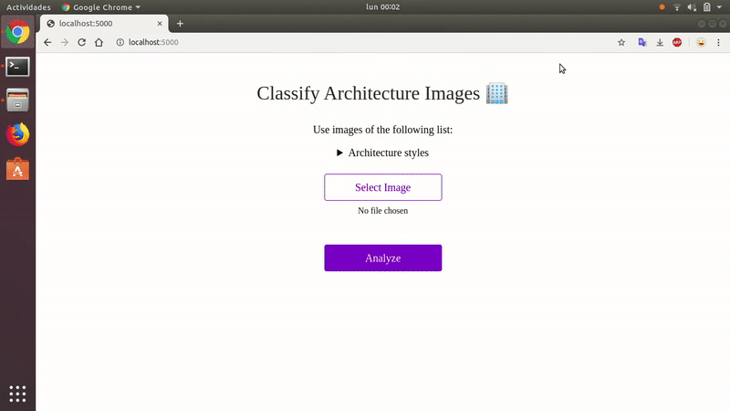
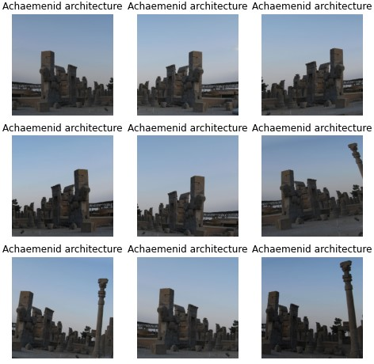
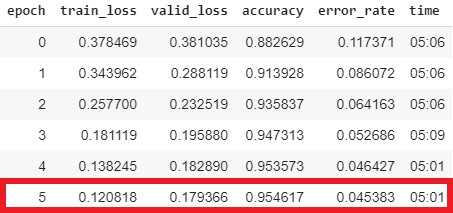
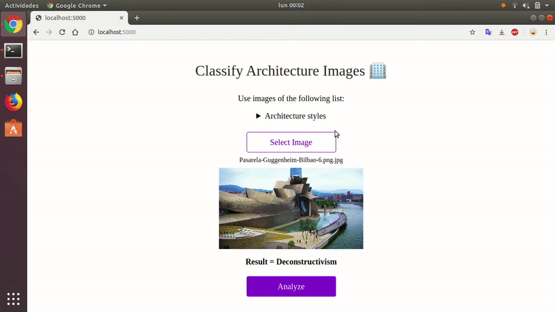
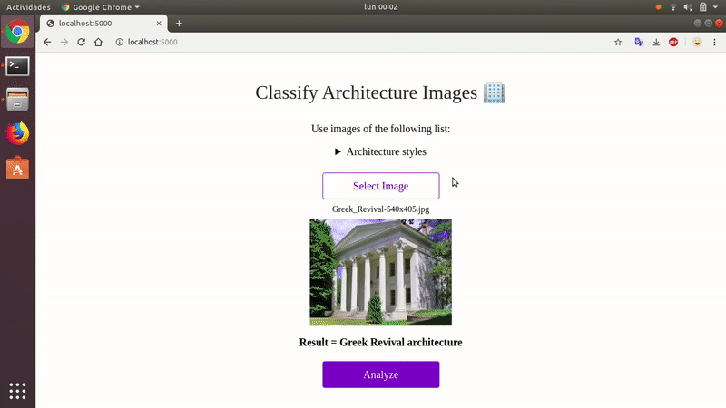
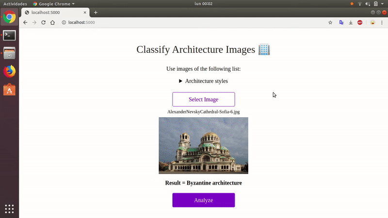
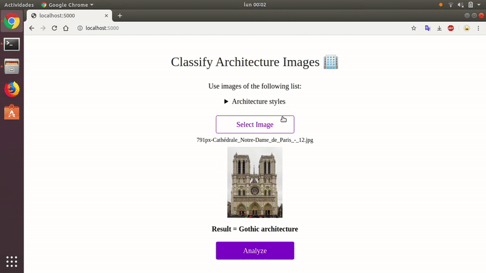

# ArchiTech
**ArchiTech** is a grad-CAM based architectural style classification model. 

Made with [fastai](https://www.fast.ai) library.
Source code on [src](./src/architectural-style-recognition.ipynb). It can be runned in [Google Colab](colab.research.google.com)

## Table of content
- [ArchiTech](#architech)
  - [Table of content](#table-of-content)
  - [Dataset](#dataset)
      - [Data augmentation](#data-augmentation)
  - [Training](#training)
      - [Training vs Test sets](#training-vs-test-sets)
  - [Results](#results)
  - [Demonstration](#demonstration)
  - [Deployment](#deployment)
    - [Run the app locally](#run-the-app-locally)
  - [License](#license)
  - [Links](#links)
  - [Authors](#authors)

## Dataset

The dataset consists of two main components.  

The first is 4720 images across 20 styles sourced entirely from Wikimedia Commons with their API.  

<b>Number of images for each style</b>

- Amazigh architecture: 155
- Architecture of Edo Period: 303
- Architecture of the Joseon Dynasty: 255
- Architecture of the Qing Dynasty: 293
- Balinese architecture: 172
- Brutalist architecture: 256
- Buddhist architecture: 220
- Dravidian architecture: 241
- Hausa architecture: 217
- Jain architecture: 107
- Khmer architecture: 257
- Maya architecture: 337
- Minangkabau architecture: 315
- Moorish architecture: 218
- Mughal architecture: 262
- Ottoman architecture: 324
- Pueblo architecture: 68
- Safavid architecture: 344
- Stalinist architecture: 212
- Swahili architecture: 152

The latter part is 10113 images across 25 styles and authored by:

- Danci, Marian Dumitru (@dumitrux)
- Xu, Zhe & Zhang, Ya & Tao, Dacheng & Wu, Junjie & Tsoi, Ah. (2014). Architectural Style Classification Using Multinomial Latent Logistic Regression. 10.1007/978-3-319-10590-1_39.  

<b>Number of images for each style</b>

- Achaemenid architecture: 392
- American craftsman style: 364
- American Foursquare architecture: 362
- Ancient Egyptian architecture: 406
- Art Deco architecture: 566
- Art Nouveau architecture: 615
- Baroque architecture: 456
- Bauhaus architecture: 315
- Beaux-Arts architecture: 424
- Byzantine architecture: 313
- Chicago school architecture: 278
- Colonial architecture: 480
- Deconstructivism: 335
- Edwardian architecture: 280
- Georgian architecture: 381
- Gothic architecture: 331
- Greek Revival architecture: 523
- International style: 417
- Novelty architecture: 382
- Palladian architecture: 343
- Postmodern architecture: 322
- Queen Anne architecture: 720
- Romanesque architecture: 301
- Russian Revival architecture: 352
- Tudor Revival architecture: 455

The original dataset was made by Zhe Xu.
According to the paper, the best accuracy they could get in 2014 was nearly 70% accuracy.
[Paper "Architectural Style Classification using Multinomial Latent Logistic Regression" (ECCV2014)](http://vigir.missouri.edu/~gdesouza/Research/Conference_CDs/ECCV_2014/papers/8689/86890600.pdf)

- [Final Extended dataset](https://www.kaggle.com/datasets/jungseolin/international-architectural-styles-combined)
- [Extended dataset](https://www.kaggle.com/dumitrux/architectural-styles-dataset)
- [Original dataset](https://www.kaggle.com/wwymak/architecture-dataset)

#### Data augmentation

The extended dataset is used to test the model with "real world" images, in this case google images, whicha are not taken in perfect conditions.

To make the original dataset bigger and get better results, data augmentation is used.
Which is achived creating new images, by transforming (horizontal flip, zoom, light, rotate, etc.) the images.

In this case we go from 4979 to 9588 images.

## Training

#### Training vs Test sets

The dataset is splitted in two:
  * training set (80%)
  * test set (20%)

## Results
We got a **95%** of accuracy on this dataset

## Demonstration

<b>More examples</b>

**Greek Revival:**

**Byzantine:**

**Gothic:**

**Bauhaus:**

## Deployment

The [app](./app) folder contains the application ready to deploy on [Render](https://render.com).

### Run the app locally

The app can be runned locally.

First of all, you have to check all the [Requirements](./requirements.txt), then run this command in your terminal:

    python app/server.py serve

Or in python3:

    python3 app/server.py serve

*Note: it has been only tested in Linux.*

## License

MIT License

## Links

* [fastai](https://www.fast.ai)
* [Render](https://render.com)
* [Google Colab](colab.research.google.com)

## Authors
- Jung, Seolin ([@seolinjung](https://github.com/seolinjung))
- Ference, Jill ([@JillFerence](https://github.com/JillFerence))
- Sengkeo, Puthypor ([@Puthyporsk](https://github.com/Puthyporsk))
